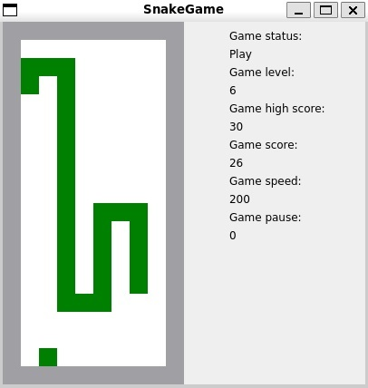
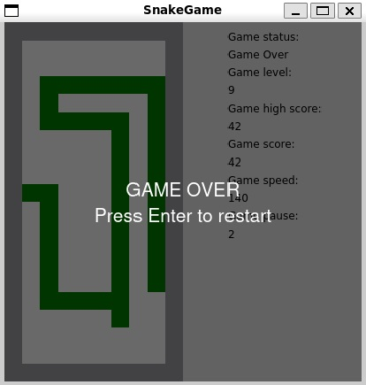

# 🐍 Snake Game (Qt C++)

Классическая игра «Змейка», реализованная на **C++/Qt**.  
Игрок управляет змейкой, которая должна собирать яблоки и избегать столкновений с границами или своим хвостом.  
Поддерживается система уровней, ускорение при нажатии на **Space**, сохранение рекордов.

---

## 🚀 Возможности

- 🎮 Управление стрелками (**↑ ↓ ← →**)
- ⏸ Пауза (**Enter**)
- ⚡ Временное ускорение (**Space**)
- ❌ Выход (**Esc**)
- 🏆 Система очков и уровней (ускорение игры с ростом счета)
- 📂 Сохранение рекорда в файл `hs_log.txt`

---

## 📷 Скриншоты

Игра:



---

Конец игры:



## 🔧 Установка и запуск

### Клонируем репозиторий

```bash
git clone https://github.com/username/snake-game-qt.git
cd snake-game-qt
cd src
```

### Запуск

```bash
make all
./SnakeGame
```

## 📂 Структура проекта

**mainwindow.cpp, mainwindow.h** — логика игры

**gui/desktop/frontend.h** — отрисовка интерфейса

**hs_log.txt** — хранение рекорда

## 🏗 Требования

**Qt 5** или **6**

**C++17** (или выше)

**CMake** или **qmake**

## 🙌 Автор

Разработчик: **wartorle**  
Если понравился проект — ⭐️ поставь звезду в репозитории!
